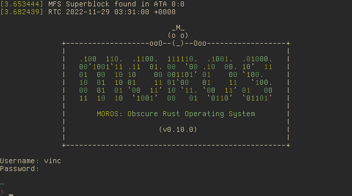

# MOROS: Obscure Rust Operating System

MOROS is a hobby operating system written in Rust by [Vincent Ollivier](https://vinc.cc).

It targets computers with a x86-64 architecture and a BIOS, so mostly from 2005
to 2020, but it also runs well on most emulators (Bochs, QEMU, and VirtualBox).

This project started from the [seventh post][1] of the second edition of
[Writing an OS in Rust][2] by Philipp Oppermann and by reading the
[OSDev wiki][3] along with many open source kernels.

## Features

- [x] External bootloader (using [bootloader](https://github.com/rust-osdev/bootloader))
- [x] x86 CPU support (using [x86_64](https://crates.io/crates/x86_64))
- [x] Hardware interrupts (using [pic8259](https://crates.io/crates/pic8259))
- [x] PS/2 Keyboard with customizable layout (using [pc-keyboard](https://crates.io/crates/pc-keyboard))
- [x] VGA Text mode with customizable font and color palette
- [x] Serial output (using [uart_16550](https://crates.io/crates/uart_16550))
- [x] Paging
- [x] Heap allocation (using [linked_list_allocator](https://crates.io/crates/linked_list_allocator))
- [x] ACPI shutdown (using [acpi](https://crates.io/crates/acpi) and [aml](https://crates.io/crates/aml))
- [x] RTC clock
- [x] PCI devices
- [x] ATA PIO mode
- [x] Random number generator (using [rand_hc](https://crates.io/crates/rand_hc))
- [x] RTL8139 network card
- [x] AMD PCNET network card
- [x] DHCP/IP/TCP/UDP/DNS/HTTP network protocols (using [smoltcp](https://crates.io/crates/smoltcp))
- [x] Basic [filesystem](doc/filesystem.md)
- [x] Basic [shell](doc/shell.md)
- [x] Basic [text editor](doc/editor.md)
- [x] Basic [lisp](doc/lisp.md) interpreter
- [x] Basic file and [network](doc/network.md) commands
- [x] Basic userspace for NASM and Rust programs without alloc
- [ ] Multitasking
- [ ] C standard library port

## Documentation

Documentation is available [here](doc/index.md)

## Setup

Clone the repo:

    $ git clone https://github.com/vinc/moros
    $ cd moros

Install the required tools with `make setup` or the following commands:

    $ curl https://sh.rustup.rs -sSf | sh
    $ rustup install nightly
    $ rustup default nightly
    $ cargo install bootimage

## Usage

Build the image to `disk.img`:

    $ make image output=video keyboard=qwerty

Run MOROS in QEMU:

    $ make qemu output=video nic=rtl8139

Run natively on a x86 computer by copying the bootloader and the kernel to a
hard drive or USB stick (but there is currently no USB driver so the filesystem
will not be available in that case):

    $ sudo dd if=target/x86_64-moros/release/bootimage-moros.bin of=/dev/sdx && sync

MOROS will open a console in diskless mode after boot if no filesystem is
detected. The following command will setup the filesystem on a hard drive,
allowing you to exit the diskless mode and log in as a normal user:

    > install

**Be careful not to overwrite the hard drive of your OS when using `dd` inside
your OS, and `install` or `disk format` inside MOROS if you don't use an
emulator.**

## Tests

Run the test suite in QEMU:

    $ make test

## License

MOROS is released under MIT.

[1]: https://github.com/phil-opp/blog_os/tree/post-07
[2]: https://os.phil-opp.com
[3]: https://wiki.osdev.org
