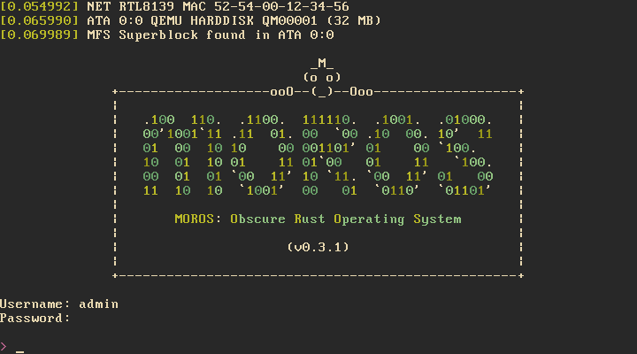

# MOROS: Obscure Rust Operating System

MOROS is a toy operating system written in Rust for the x86 architecture.

This project started from the [seventh post][1] of the second edition of
[Writing an OS in Rust][2] by Philipp Oppermann and by reading the
[OSDev wiki][3] along with many open source kernels.

## Features

- [x] External bootloader (using [bootloader](https://github.com/rust-osdev/bootloader))
- [x] x86 CPU support (using [x86_64](https://crates.io/crates/x86_64))
- [x] Hardware interrupts (using [pic8259_simple](https://crates.io/crates/pic8259_simple))
- [x] PS/2 Keyboard (using [pc-keyboard](https://crates.io/crates/pc-keyboard))
- [x] VGA Text mode output
- [x] Serial output (using [uart_16550](https://crates.io/crates/uart_16550))
- [x] Paging
- [x] Heap allocation (using [linked_list_allocator](https://crates.io/crates/linked_list_allocator))
- [x] RTC clock
- [x] PCI enumeration
- [x] ATA PIO mode
- [x] Random number generator
- [x] RTL8139 network card
- [x] DHCP/IP/TCP/UDP/DNS/HTTP protocols (using [smoltcp](https://crates.io/crates/smoltcp))
- [x] Basic filesystem
- [x] Basic shell
- [x] Basic text editor
- [x] Basic file and network commands
- [x] A LOT OF SHORTCUTS TO GET EVERYTHING WORKING
- [x] HERE BE DRAGONS
- [ ] Processes
- [ ] Multitasking
- [ ] A real userspace

## Setup

Install tools:

    curl https://sh.rustup.rs -sSf | sh
    rustup install nightly
    rustup default nightly
    rustup component add rust-src
    rustup component add llvm-tools-preview
    cargo install cargo-xbuild bootimage

## Usage

Build image to `disk.img`:

    make image output=vga keyboard=qwerty

Run on QEMU:

    make qemu output=vga

Run on a native x86 computer by copying the bootloader and kernel to a hard
drive or USB stick (but there is currently no USB driver so the filesystem
will not be available):

    sudo dd if=target/x86_64-moros/release/bootimage-moros.bin of=/dev/sdx && sync

In both cases, MOROS will open a console in diskless mode after boot if no
filesystem is detected. The following commands will setup the filesystem on the
first hard drive of the first ATA bus, allowing you to exit the diskless mode
and log in:

    mkfs /dev/ata/0/0
    install
    user add

**Be careful not to overwrite the hard drive of your OS when using `dd` inside
your OS or `mkfs` inside MOROS.**

## LICENSE

MOROS is released under MIT.

[1]: https://github.com/phil-opp/blog_os/tree/post-07
[2]: https://os.phil-opp.com
[3]: https://wiki.osdev.org
