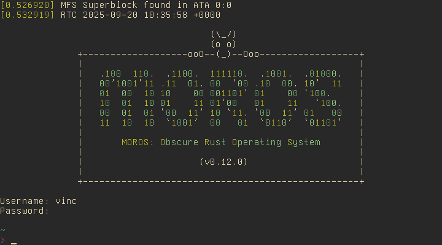

# MOROS: Obscure Rust Operating System

MOROS is a text-based hobby operating system written in Rust
by [Vincent Ollivier][0].

It targets computers with a x86-64 architecture and a BIOS, drawing inspiration
from Unix, Plan 9, and DOS to provide a simple and efficient environment for
computing and communication from the command line.

This project started from the [seventh post][1] of the second edition of
[Writing an OS in Rust][2] by Philipp Oppermann  and aims to showcase what can
be accomplished after completing an OSDev tutorial, while reading the
[OSDev wiki][3] along with many open source kernels.

[![GitHub Actions][s1]](https://github.com/vinc/moros)
[![Crates.io][s2]](https://crates.io/crates/moros)

> **Note:** the kernel is currently being refactored to support the i686
> architecture in addition to x86-64.

## Features

- External bootloader (using [bootloader][4])
- AMD64 CPU support (using [x86_64][5])
- PS/2 keyboard with customizable layout (using [pc-keyboard][6])
- VGA text mode and 320x200 graphics buffer (for games and images) with
  customizable font and color palette
- Serial output (using [uart_16550][7])
- Heap allocation (using [linked_list_allocator][8])
- ACPI shutdown (using [acpi][9] and [aml][10])
- RTC clock with userspace NTP synchronization
- Intel 8259 PIC
- PCI devices
- ATA PIO mode
- Custom [filesystem](doc/filesystem.md) with bitmap allocation, linked blocks,
  block caching, and support for files, directories, and device nodes
- Random number generator (using [rand_hc][11])
- Intel PRO/1000, RTL8139, and AMD PCNET network cards
- DHCP/IP/TCP/UDP/DNS/HTTP network protocols (using [smoltcp][12])
- AC97 and SB16 sound cards
- Paging with bitmap frame allocator
- Processes with isolated address spaces and demand paging
- Userspace with [syscalls](doc/syscalls.md) and [device files](doc/devices.md)
- [Shell](doc/shell.md) and [Lisp](doc/lisp.md) interpreter
- [Text editor](doc/editor.md) and assembler
- Some [file](doc/shell.md) and [network](doc/network.md) commands
- Some [games](doc/games.md) including DOOM

## Documentation

Documentation is available [here](doc/index.md)

## Setup

MOROS runs on x86-64 [computers](doc/hardware.md) from around 2005 to 2020,
as well as emulators like Bochs, VirtualBox, and QEMU with the latter being
the main development platform.

You will need `git`, `gcc`, `make`, `curl`, `qemu-img`,
and `qemu-system-x86_64` on the host system.

Clone the repo:

    $ git clone https://github.com/vinc/moros
    $ cd moros

Install the required tools with `make setup` or the following commands:

    $ curl https://sh.rustup.rs -sSf | sh -s -- -y --default-toolchain none
    $ rustup show
    $ cargo install bootimage

## Usage

Build the image to `disk.img`:

    $ make image output=video keyboard=qwerty

Run MOROS in QEMU:

    $ make qemu output=video nic=rtl8139

Run natively on a x86 computer by copying the bootloader and the kernel to a
hard drive or USB stick (but there is currently no USB driver so the filesystem
will not be available in that case):

    $ sudo dd if=target/x86_64-moros/release/bootimage-moros.bin of=/dev/sdx

MOROS will open a console in diskless mode after boot if no filesystem is
detected. The following command will setup the filesystem on a hard drive,
allowing you to exit the diskless mode and log in as a normal user:

    > install

**Be careful not to overwrite the hard drive of your OS when using `dd` inside
your OS, and `install` or `disk format` inside MOROS if you don't use an
emulator.**

## Tests

Run the test suite in QEMU:

    $ make test

## License

MOROS is released under MIT.

[0]: https://vinc.cc
[1]: https://github.com/phil-opp/blog_os/tree/post-07
[2]: https://os.phil-opp.com
[3]: https://wiki.osdev.org
[4]: https://github.com/rust-osdev/bootloader
[5]: https://crates.io/crates/x86_64
[6]: https://crates.io/crates/pc-keyboard
[7]: https://crates.io/crates/uart_16550
[8]: https://crates.io/crates/linked_list_allocator
[9]: https://crates.io/crates/acpi
[10]: https://crates.io/crates/aml
[11]: https://crates.io/crates/rand_hc
[12]: https://crates.io/crates/smoltcp

[s1]: https://img.shields.io/github/actions/workflow/status/vinc/moros/rust.yml
[s2]: https://img.shields.io/crates/v/moros.svg
