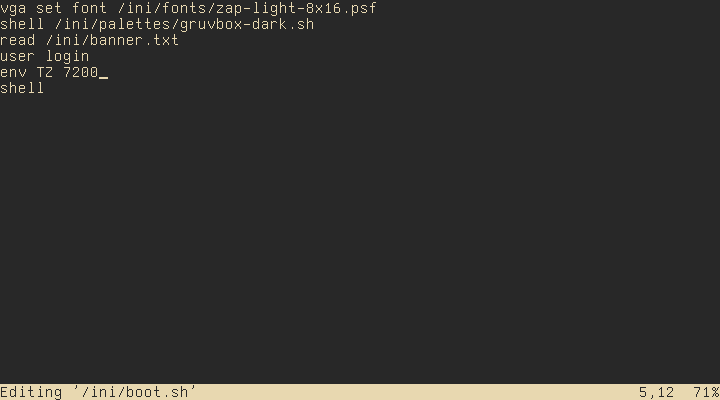

# MOROS Editor

## Commands

- `CTRL` + `C` to quit without saving and without warnings
- `CTRL` + `Q` to quit without saving
- `CTRL` + `X` to quit after saving
- `CTRL` + `W` to save
- `CTRL` + `A` to move cursor to begining of line
- `CTRL` + `E` to move cursor to enf of line
- `CTRL` + `T` to move cursor to begining of file
- `CTRL` + `B` to move cursor to enf of file
- `CTRL` + `D` to cut (delete) a line
- `CTRL` + `Y` to copy (yank) a line
- `CTRL` + `P` to paste (put) a line
- `CTRL` + `F` to find a string in the file
- `CTRL` + `N` to find the next string in the file
