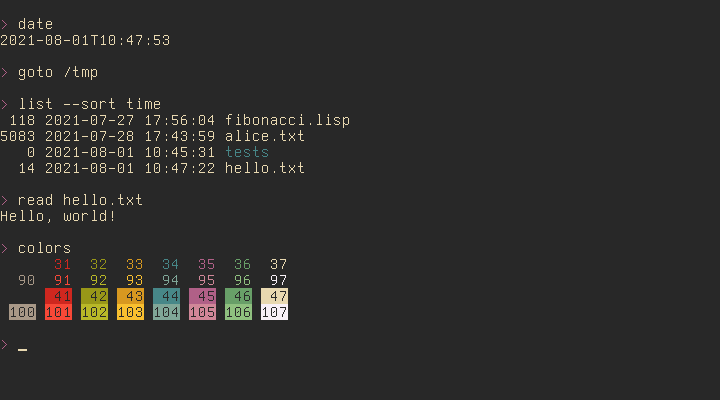
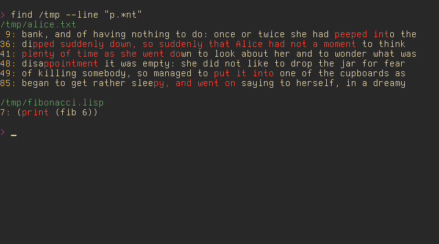
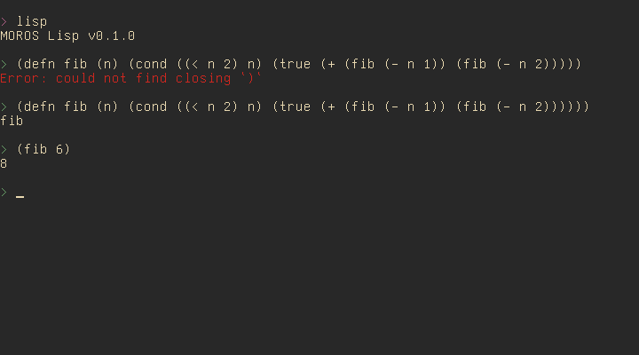
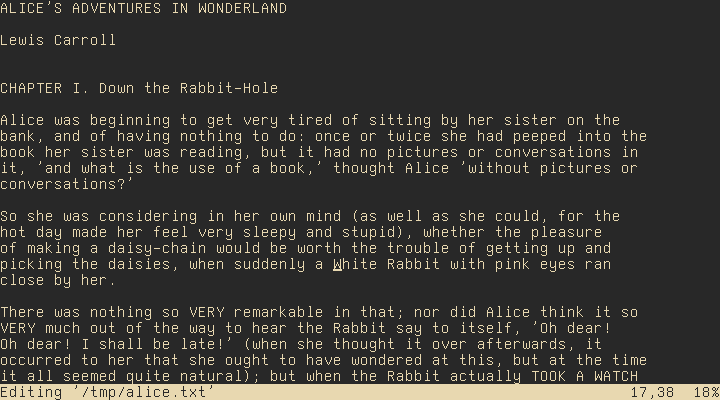
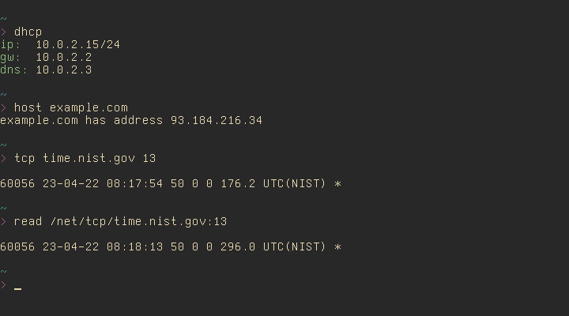
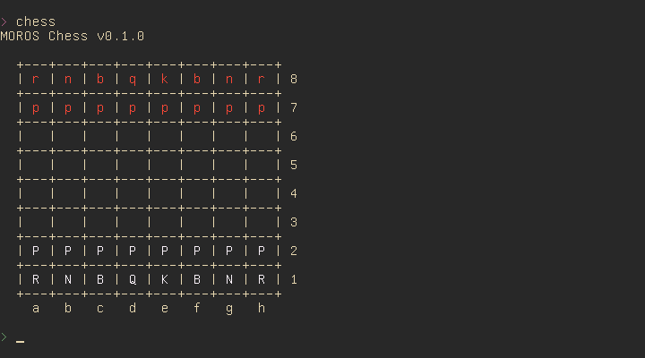

# MOROS: Obscure Rust Operating System

MOROS is a hobby operating system written in Rust by [Vincent Ollivier](https://vinc.cc).

It targets computers with a x86-64 architecture and a BIOS, so mostly from 2005
to 2020, but it also runs well on most emulators (Bochs, QEMU, and VirtualBox).

* * *

The first task when running the OS is to install the
[filesystem](filesystem.md) on a disk (or in RAM) using the `install` program,
although it's possible to skip the installation and stay in read only mode.

Everything in MOROS is done from a command line interface and most programs are
rather minimalist.

It has a [shell](shell.md):

With a few programs like `find` that use a [regex engine](regex.md) to find
files or lines:

It has a [calculator](calculator.md) and also a [lisp](lisp.md) interpreter:

And a [text editor](editor.md):

It has a [network stack](network.md) with two drivers for RTL81339 and PCNET cards:

It even has a chess game:

Finally here are a few commands to try it out:

    > date
    2021-08-12T20:16:48

    > memory
    Size: 16777216
    Used:    15400
    Free: 16761816

    > disk
    Size: 8388608
    Used:  445440
    Free: 7943168

    > list /tmp
    5083 2021-08-07 15:10:09 alice.txt
     118 2021-08-07 15:10:09 fibonacci.lisp

    > goto /tmp

    > read fibonacci.lisp
    (label fib
      (lambda (n)
        (cond
          ((< n 2) n)
          (true (+ (fib (- n 1)) (fib (- n 2)))))))

    (print (fib 6))

    > lisp fibonacci.lisp
    8

    > find /tmp --line "p.*nt"
    /tmp/alice.txt
     9: bank, and of having nothing to do: once or twice she had peeped into the
    36: dipped suddenly down, so suddenly that Alice had not a moment to think
    41: plenty of time as she went down to look about her and to wonder what was
    48: disappointment it was empty: she did not like to drop the jar for fear
    49: of killing somebody, so managed to put it into one of the cupboards as
    85: began to get rather sleepy, and went on saying to herself, in a dreamy

    /tmp/fibonacci.lisp
    7: (print (fib 6))

    > dhcp
    DHCP Discover transmitted
    DHCP Offer received
    Leased: 10.0.2.15/24
    Router: 10.0.2.2
    DNS: 10.0.2.3

    > tcp time.nist.gov 13
    Connecting to 132.163.97.4:13

    59438 21-08-12 20:18:27 50 0 0 358.8 UTC(NIST) *

    > halt
    MOROS has reached its fate, the system is now halting.
    [782.191890] ACPI Shutdown
